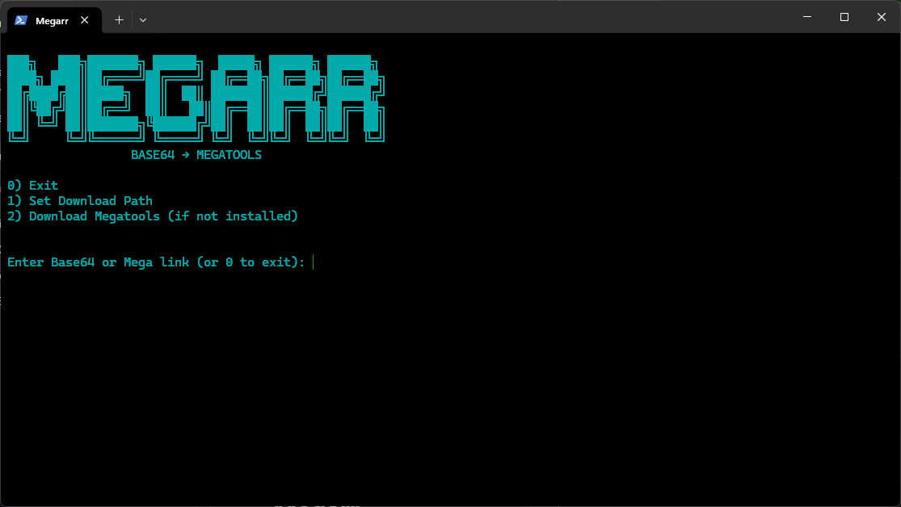

# Megarr

BASE64 → MEGATOOLS  

Base64/MegaLink decoder and downloader using megatools

Megarr is a Terminal UI utility to **decode Base64 strings** or **MegaLinks** and download them using **megatools**.  
It is designed to be **fully standalone on Linux**, requiring no Python or additional dependencies for end users.

## Download

### Latest Release

- [Windows EXE](https://github.com/g-nit/megarr/releases/download/v1.0.0/megarr-windows-x64-v1.0.0.exe)  
- [Linux binary](https://github.com/g-nit/megarr/releases/download/v1.0.0/megarr-linux-x64-v1.0.0)
- [Android Termux binary/arm64](https://github.com/g-nit/megarr/releases/download/v1.0.0/megarr-android-termux-arm64-v1.0.0)

---

## Features

- Decode Base64 strings automatically.  
- Accept MegaLinks directly.  
- Download files via `megatools`, with options to choose specific files or set a download path.  
- User-friendly interactive menu.

---

## Preview

## Usage

Enter a **Base64 string** or a **MegaLink**.  

- Base64 strings will be decoded automatically.  
- MegaLinks will be downloaded using `megatools`.  
- You can set a **download path** from the menu.

After decoding or detecting a MegaLink, options include:

- Download directly  
- Choose specific files to download  
- Decode another Base64  
- Exit  

---

## Notes

- If `megatools` is not installed, Megarr can detect this and offer to download the correct version automatically.  
- Works on Linux and is fully portable once compiled.  

---

## License

[MIT License](LICENSE)  
  

